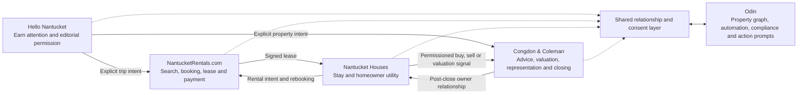

# Nantucket Ecosystem Strategy
## Integrated Company Picture

**Congdon & Coleman · NantucketRentals.com · Nantucket Houses · Hello Nantucket · Odin**  
**Version 1.0 · August 2026**

**Status:** Approved August 10, 2026 by Stephen Maury, for the business,
legal, privacy/data, and accounting areas. Qualified legal, privacy, and
accounting adviser validation remains outstanding, with the affected items
and their gating conditions listed in
`nantucket-ecosystem-strategy-v1.0-decision-record.md`.

**Document owner:** Stephen Maury (stephen@maury.net)  
**Review cadence:** Monthly, on the 15th  
**Next review:** September 15, 2026

Amendments are recorded as dated changes under the change protocol in
`nantucket-ecosystem-strategy-v1.0-decision-record.md`; Version 1.0 remains
recoverable rather than being silently overwritten.

---

## 1. Executive Direction

The company will operate as a **proprietary, transparently affiliated house of brands** built around one continuous Nantucket property relationship.

Each customer-facing brand owns a distinct job:

- **Hello Nantucket** earns editorial attention and permission before transaction intent exists.
- **NantucketRentals.com** converts active rental intent into a booking.
- **Nantucket Houses** makes the stay and ownership relationship useful between transactions.
- **Congdon & Coleman** provides the licensed human judgment required for buying, selling, valuation, and negotiation.
- **Odin** orchestrates the shared data, automation, exceptions, compliance, and staff action layer internally.

The brands remain visually and verbally distinct, but common ownership and relevant commercial relationships are never concealed. Customers should understand who is communicating, why their information is being used, and what will happen next.

The strategic objective for the next 12–36 months is to prove that this integrated model can:

1. Improve the experience and retention of homeowners and guests.
2. Increase direct and repeat rental contribution.
3. Reduce routine service work without reducing service quality.
4. Create permissioned, attributable buying and selling opportunities.
5. Increase ecosystem contribution margin per labor FTE.

The plan no longer depends on Nantucket Houses becoming a neutral inter-broker platform. External integrations may be supported when they improve an existing customer's experience, but third-party brokerage subscriptions, competitor lead routing, and island-wide network effects are removed from the base case.

The company should not claim a software-style valuation merely because it owns software. A re-rating becomes credible only if recurring revenue, retention, gross margin, clean cost allocation, separable intellectual property, and permissioned data rights are demonstrated.

---

## 2. Company Architecture

Hello Nantucket is an acquisition source, not the exclusive top of the funnel. Customers may enter directly through C&C, NantucketRentals, referrals, search, advertising, or an existing relationship. The system preserves the origin of each relationship while allowing the appropriate brand to take over when the customer's job changes.

### Systems of record

- **NR/booking backend:** rental inventory, availability, bookings, leases, stays, and payments.
- **CRM:** canonical relationship, commercial intent, agent ownership, opportunity status, attribution, communication permissions, and suppression.
- **Odin/ACK property graph:** canonical property identity, compliance, integration events, action prompts, exceptions, and operational history.
- **Nantucket Houses:** product use, owner workflows, guest communication, AI/human actions, and explicit intent signals.
- **Accounting:** recognized revenue, retained brokerage contribution, direct costs, allocated labor, and FTE.

---

## 3. Brand Portfolio

| Brand | Priority audience | Primary job | Promise | Main action | Governing KPI |
|---|---|---|---|---|---|
| **Hello Nantucket** | Nantucket-curious readers, repeat visitors, seasonal residents, and future renters or owners | Earn attention and editorial permission | **A year-round journal of island life** | Subscribe; explicitly explore a trip or property topic | Fully loaded cost per Day-90 retained engaged subscriber; mature cohort contribution-to-cost |
| **NantucketRentals.com** | Renters actively searching and ready to transact | Convert rental demand | **The direct way to book Nantucket** | Search and complete a booking | Booking contribution and search-to-booking conversion |
| **Nantucket Houses** | Eligible C&C/NR homeowners and booked guests | Maintain useful continuity between transactions | **Your Nantucket home and stay, organized in one place** | Activate and complete a meaningful task | Eligible-user activation plus core-task completion |
| **Congdon & Coleman** | Buyers, sellers, and owners needing judgment | Provide trusted licensed counsel | **The island's trusted human counsel for buying, selling, and owning** | Speak with an adviser or request a confidential valuation | Ecosystem-attributed closed contribution |
| **Odin** | Staff and agents | Turn data and automation into clear action | **Handled—FYI, or your move—with the context attached** | Resolve prioritized action prompts and exceptions | Response SLA, resolution quality, and capacity released |

### Hello Nantucket identity

Recommended public system:

> **Hello Nantucket**  
> *A year-round journal of island life*  
> Published by Congdon & Coleman

The publisher credit should be easy to find in the Instagram bio, website About page and footer, newsletter footer, and signup/privacy language. Commercial recommendations to affiliated brands should be identified where the relationship matters.

Hello Nantucket may be editorially distinct, but it must not be described as unaffiliated or institutionally independent.

### Content ownership

| Topic | Owning brand |
|---|---|
| Island culture, local voices, history, stewardship, seasonality, and visiting thoughtfully | Hello Nantucket |
| Rental inventory, availability, trip planning tied to booking, leases, and payments | NantucketRentals.com |
| Homeowner and guest product education, stay operations, documents, and service workflows | Nantucket Houses |
| Real-estate market reports, valuation, ownership counsel, buying, and selling | Congdon & Coleman |
| Operational, compliance, data-quality, and agent-action reporting | Odin |

Hello should not publish listings, act as a booking surface, or become the primary publisher of real-estate and rental-market intelligence. It may link to clearly identified affiliated services and may interpret broader island-life data within its editorial remit.

---

## 4. Customer and Communication Handoffs

### Hello Nantucket

- Editorial subscription permits Hello editorial communication only.
- A subscriber becomes commercially actionable only after a separate commercial opt-in or an explicit rental/property action.
- A trip-planning or booking action routes to NantucketRentals.
- A buying, selling, or valuation action routes to a named C&C adviser.
- Hello never routes a reader directly into Nantucket Houses.

### NantucketRentals

- Search, availability, booking, lease, payment, and transactional rental messages remain NR-branded.
- A signed lease creates an eligible Nantucket Houses invitation.
- Booking and stay records retain their originating source, including Hello where applicable.

### Nantucket Houses

- Homeowner operations, home guides, stay logistics, documents, and in-app communication remain NH-branded.
- Rental or rebooking intent hands back to NR.
- Buying, selling, valuation, and showing requests route to a named C&C adviser under approved consent and escalation rules.
- Stay, owner-service, safety, and complaint escalations remain in the NH or NR service voice and route through Odin to the accountable human team.

### Congdon & Coleman

- Anything involving representation, valuation, fiduciary judgment, negotiation, or consequential advice comes from a named person.
- C&C sends new owners into NH after closing and qualified rental demand into NR.

### Global communication rule

Each communication has one sending brand and one customer job. Marketing contacts are subject to shared frequency caps and suppression; transactional and service communications are classified separately but still logged. An unsubscribe or preference change must propagate to every system affected by that specific permission.

---

## 5. Trust, Consent, and Editorial Governance

Common ownership does not create unrestricted permission to use customer information across brands.

Consent should be stored at:

`person × brand × channel × purpose × policy version × timestamp`

Required states include:

- Hello editorial subscriber
- Rental marketing opt-in
- Property-interest opt-in or explicit inquiry
- Transactional/service eligibility
- Global and brand-level suppression

The CRM may receive Hello subscriber records for identity resolution, attribution, deduplication, and suppression. It may not automatically activate NR, NH, or C&C marketing.

Hello Nantucket also requires a written editorial charter covering:

- Publisher and affiliated-service disclosure
- Editorial versus sponsored or affiliated content
- Named contributors and sourcing standards
- Corrections and complaints
- Photography, contributor, and user-generated-content rights
- Treatment of environmentally or culturally sensitive locations
- Local-business features and conflicts
- Sponsorship acceptance and labeling

The editorial stance should be positive and durable: knowing Nantucket beyond the postcard, visiting thoughtfully, supporting the year-round community, and respecting the island. It should not define itself through a temporary anti-influencer controversy.

---

## 6. Economic Model

### Company north star

**Trailing-12-month ecosystem contribution margin ÷ average labor FTE**

Contribution margin includes:

- Company-retained brokerage contribution after agent and referral splits
- Rental contribution
- Recurring or platform revenue
- Less directly variable payment, transaction, acquisition, AI, communication, and fulfillment costs

Average labor FTE includes employees and long-term contractors converted to FTE so outsourcing cannot artificially improve the measure.

Revenue per employee remains a diagnostic, not the governing metric.

### Role of each brand in value creation

- **Hello Nantucket:** reduces acquisition cost only if incremental, permissioned demand and downstream contribution exceed fully loaded editorial cost.
- **NantucketRentals:** generates booking contribution and improves direct/repeat economics.
- **Nantucket Houses:** creates retention, capacity release, service quality, and attributable intent.
- **C&C:** converts high-value licensed opportunities into retained brokerage contribution.
- **Odin:** reduces coordination cost, protects quality, and makes automation auditable.

Hello's cost must include staff time, contractors, photography, rights, platform fees, moderation, analytics, and legal/privacy work. “Content effort” is a cost. Near-zero CAC, no-headcount scalability, and superior economics are hypotheses to prove rather than claims to publish.

Brand- and product-level costs should be allocated from the beginning so the company can distinguish real operating leverage from costs absorbed elsewhere.

---

## 7. Value Thesis and Separability

Enterprise value is an outcome of transferable earnings, durable customer relationships, clean rights, operating independence, and credible options—not a forecasted multiple. The company should preserve five Month-36 choices without assuming that any one will be exercised.

| Month-36 option | Conditions that should already be true |
|---|---|
| Continue owning the integrated Nantucket ecosystem | Core contribution and retention are durable; service quality and capacity release are proven; the operation is not dependent on one person's undocumented knowledge |
| Deepen Nantucket monetization | At least one adjacent product has separately measured adoption, retention, gross margin, and contribution; core trust and service metrics remain intact |
| Replicate selected capabilities geographically | Reusable technology and operating workflows are separated from Nantucket-specific content and relationships; local-market entry costs and operating requirements are documented; Hello's editorial credibility is not assumed portable |
| Separate or capitalize a product/business line | Standalone P&L and cost allocation exist; code, brands, data rights, contracts, infrastructure, and operating responsibilities can be identified and transferred or licensed; intercompany services are documented |
| Pursue a strategic transaction | Financials reconcile to source systems; IP chain of title and material contracts are clean; data use and transfer rights are documented; customer concentration, retention, security, and key-person risks are measurable |

### Standing corporate-hygiene workstream

The executive sponsor is accountable for separability. The Office Manager maintains the evidence register; qualified legal and accounting advisers validate matters within their disciplines.

- Maintain a current entity map and documented intercompany services, cost allocation, and asset ownership.
- Keep an IP inventory covering source code, models, content, photography, domains, data assets, and know-how. Obtain appropriate employee and contractor invention, work-product, confidentiality, and rights assignments with counsel.
- Maintain brand, domain, and registration records and a documented decision on which entity owns or licenses each asset.
- Preserve consent provenance, data-source and vendor rights, retention/deletion rules, and any transfer or change-of-control limitations.
- Maintain a material-contract register showing assignment, renewal, termination, exclusivity, and change-of-control terms.
- Produce brand- and product-level P&Ls with fully loaded labor, shared-service allocation, platform run cost, and reconciliations to accounting.
- Keep source repositories, build/deployment access, architecture records, decision records, vendor credentials, and operational runbooks under company control with at least one trained backup.
- Retain privacy, security, compliance, incident, and remediation evidence in a diligence-ready record.

Review this checklist quarterly. Beginning at the end of Year 1, run an annual lightweight mock-diligence review and convert every material gap into a named action with an owner and due date.

---

## 8. Prove → Scale → Expand

The stage clock follows Nantucket's operating calendar rather than treating all evidence as equally available throughout the year.

| Decision window | Evidence available | Decision permitted |
|---|---|---|
| August–October 2026 | Baseline, instrumentation, identity, consent, compliance, and sync readiness | Enter bounded pilots |
| November 2026–April 2027 | Owner planning, agreement, availability, document, compliance, and operating workflows | Pass, hold, or expand owner components conditionally |
| May–July 2027 | Pre-arrival and in-stay guest behavior, support demand, and property-specific AI | Pass, hold, or stop guest components |
| August 2027 | Combined owner, guest, trust, data-quality, and economic evidence | Make the earliest complete Stage 1 decision; if guest evidence is insufficient, hold guest scaling and move the combined decision to October |

A component may pass independently when its relevant cohort has matured. The ecosystem as a whole does not advance merely because an out-of-season measure is unavailable or one component performs well.

Decision states have specific meanings:

- **Pass:** the relevant cohort is mature, the evidence floor is met, and every applicable hard gate and guardrail passes.
- **Hold/continue measuring:** timing, volume, or statistical power is insufficient; scope and budget remain fixed while evidence matures, and no proof or scale claim is made.
- **Stop/rework:** a mature cohort misses a hard quality, trust, reliability, or economic gate, or a critical guardrail is breached.

### Gate parameter definition and freeze rule

Several gates below are stated as provisional, approximate, or deferred to a
budget or SLA that has not yet been set. Those are placeholders, not gates. A
gate governs a decision only once its parameter is a specific, recorded value.

Three rules apply to every parameter in the register:

1. **Definition is a change.** Fixing a blank for the first time requires the
   same dated amendment as revising an existing number — reason, owner,
   affected metric, and approval — under the change protocol in the decision
   record. A parameter is not exempt because no prior value was recorded.
2. **Fix before the window opens.** Each parameter must be set before the
   measurement window it governs begins. A gate whose parameter was not fixed
   in time cannot return **pass**; the affected component defaults to
   **hold/continue measuring** until the next relevant cohort, which is a
   deliberate cost of leaving a gate undefined.
3. **No definition after results are visible.** A parameter may not be set or
   revised once the results it governs are visible to the person setting it.
   Where a value must change mid-flight for an operational reason, the
   amendment records who had seen which results at the time, and the affected
   cohort is reported as unblinded.

| Parameter | Where it governs | Fix by |
|---|---|---|
| Design-partner cohort size (stated as approximately 10–20 properties) and the pre-registered gate-cohort definition | Stage 1 core pilot; separation of debug cohort from promotion evidence | Before the first design-partner property is onboarded |
| Owner evidence floor (stated as roughly 40 owners completing a core workflow) and the valid seasonal comparison for owner-service minutes | Stage 1 provisional owner and operating gates | Before the winter owner cohort opens, November 2026 |
| Source-specific freshness SLA, property-matching sample and audit method, and the approved support-capacity budget for manual reconciliation | Stage 1 sync promotion conditions; write-back approval | Before any pilot inventory sync begins, including view-only |
| Guest evidence floors (stated as roughly 150 activated guests and 100 in-scope AI conversations), the matched 2026 or historical comparison cohort, and the audited-accuracy sampling method | Stage 1 provisional guest and stay gates | Before May–July 2027 arrivals, and no later than April 30, 2027 |
| Hello capacity budget in burdened hours, the fully loaded cost ceiling per Day-90 engaged subscriber, the publishing and subscriber floors (stated as approximately 24 posts, six newsletters, 250 verified subscribers), and the versioned approved non-open qualifying-event list | Hello audience-fit, cost, and engagement gates; Day-30 and Day-90 cohort definitions | Before Hello Month 1, the first full public-launch month |
| Hello commercial evidence floor (stated as approximately 20 qualified inquiries and five attributable bookings) and the qualified-lead cost and payback ceilings | Hello Year 1 commercial promotion gates | Before the first Day-365 Hello cohort matures |
| Probability weights for the financial bridge | Low, base, and high 12-, 24-, and 36-month bridges | Before the bridges are published; otherwise use realized contribution only, as section 12 requires |
| The 15% uncommitted capacity buffer, stated as provisional, and each role's peak-period definition | Capacity and management cadence | At the close of Stage 0 |
| Stage 2 provisional exit criteria | Stage 2 promotion | At the Stage 1 portfolio decision, before Stage 2 begins |

The executive sponsor approves each definition and the Office Manager records
it in the amendment log, consistent with the Stage 0 rule that metric
definitions are frozen before automation changes the workflow. Values already
stated as firm in this document — activation, containment, accuracy, CSAT,
reliability, coverage, and payback thresholds — are gates now and change only
by amendment.

### Stage 0 — Instrument and qualify

**Timing:** August–October 2026

### Immediate baseline actions — begin by August 17, 2026

These actions precede the broader approval sequence because the remaining 2026 stays and turnovers cannot be recreated later.

- The Vacation Rental Coordinator begins time-by-task capture for every sampled remaining stay, turnover, and owner-service workflow using a fixed taxonomy: rates/availability, agreement and payment follow-up, pre-arrival, home-guide questions, in-stay support, issue escalation, rebooking, owner communication, and reconciliation.
- Each record carries the relevant `property_id`, `booking_id` or `lease_id`, task type, intervention reason, and elapsed staff minutes. System timestamps and a weekly sample audit validate self-reported time.
- Launch a lightweight post-stay CSAT instrument in the existing service voice with stable core questions, response-rate tracking, and the same wording reserved for the 2027 treated and comparison cohorts.
- Use the remaining August–September 2026 data to validate the instruments and establish a directly observed late-season benchmark. Do not present it as a seasonally identical substitute for May–July.
- Reconstruct May–July 2026 handling time only where objective logs support it. Where a valid historical comparison does not exist, retain a concurrent matched human-service cohort in 2027 rather than compare the pilot against estimates.
- The Office Manager certifies baseline completeness and exceptions weekly; the executive sponsor approves the task taxonomy and freezes metric definitions before automation changes the workflow.

Company pass conditions:

- Eight weeks of usable operational, financial, conversion, and satisfaction baselines.
- Backfill 24–36 months where possible so seasonal comparisons do not depend on eight off-peak weeks.
- Run a bounded 2026 compliance-reminder and verification campaign on eligible properties so the current renewal cycle produces evidence; Stage 1 then tests ongoing document maintenance and exception resolution.
- At least 95% of eligible pilot records resolve to a canonical person and property.
- Invitation, escalation, and suppression triggers succeed in at least 98% of tests.
- Consent, disclosure, attribution, communication, and AI-escalation rules are approved.
- All material actions and human interventions are measurable.

Hello launch conditions:

- Named editor, accountable business owner, fixed weekly time budget, backup approver, and six-week content backlog.
- Ownership, affiliated-link, signup, and privacy disclosures approved.
- Editorial and commercial consent stored separately.
- Signup, confirmation, unsubscribe, suppression, deletion, and CRM attribution tested end to end.
- Editorial, correction, sensitive-location, and image-rights policies in place.

A Hello delay does not block the core NR/NH/C&C pilot.

### Stage 1 — Prove the owned relationship loop

**Timing:** November 2026–August 2027, with seasonally split evaluations; extend the decision window through October only if the guest evidence floor has not matured

The proof clock follows the actual Nantucket operating cycle:

- **Owner and operating workflows:** evaluated from November 2026 through April 2027, when owners set rates and availability, renew agreements, maintain document evidence, and remediate compliance exceptions.
- **Guest activation and stay operations:** evaluated using May–July 2027 arrival cohorts, with the first scheduled decision review in August 2027. If the pre-set evidence floor is not reached, the guest component remains on hold and measurement may extend through September without lowering the gate.
- **Commercial closings and Hello conversions:** tracked in longer dated cohorts rather than forced into the first operating season.

Owner workflows may receive a conditional continue/expand decision after the winter cohort. The complete Stage 1 promotion decision cannot be made until a meaningful summer guest cohort exists.

Core pilot:

- Begin with approximately 10–20 willing design-partner properties as a shadow and reliability cohort. This cohort may be selected for engagement to debug the product, but its activation rate cannot prove general adoption.
- Measure promotion gates on a separately identified, pre-registered invite cohort drawn from the eligible population, with a matched comparison where practical. Report design-partner and gate-cohort results separately.
- Expand only after workflow reliability is demonstrated, with a target evidence floor of roughly 40 owners completing a core workflow.
- For the later guest evaluation, seek a useful evidence floor of roughly 150 activated guests and 100 in-scope AI conversations; extend the cohort through September if volume is insufficient rather than lowering the gate.
- Include calendar, rate, availability, document, and agreement-status self-service.
- Build on the existing crawler to ship renewal reminders, insurance-document tracking, and permit-display verification as part of the NH base service. These are included retention features through Stages 1 and 2; there is no Year 1 compliance upsell, and premium monetization comes later.
- Preserve year-one sync work for existing C&C and authorized co-brokered inventory, including the already scoped Barefoot-pattern integrations. Eligibility requires a current C&C/NR service relationship and documented property-level authorization; it never includes a partner's broader inventory. Start with owner/staff visibility, then permit narrow write-back only after property mapping and reconciliation quality pass. This is customer servicing, not a neutral brokerage-platform strategy.
- Invite signed-lease guests into home-guide, stay-logistics, messaging, and narrowly scoped property Q&A workflows.

Sync promotion conditions:

- Read/view sync is complete for the supported owned or authorized co-brokered pilot inventory before any write-back begins.
- Property matching is at least 99.5% accurate, source retrieval succeeds at least 99% of the time, and at least 95% of updates arrive within the source-specific freshness SLA for 30 consecutive days.
- Unresolved discrepancies remain below 0.5%, with no user-visible error affecting a booking or owner decision.
- Write-back begins in shadow mode, is limited field by field, and has a complete audit trail, conflict alerts, and rollback coverage.
- No audited or production write creates an unauthorized overwrite, duplicate reservation, or booking-, lease-, rate-, or availability-affecting conflict. Any such event returns that integration to view-only mode.
- Manual reconciliation stays within the approved support-capacity budget. Financial data, executed agreements, and other high-consequence fields remain excluded until separately validated.

Provisional owner and operating gates, evaluated after the winter cohort:

- Owner activation ≥60%; at least 50% complete a second meaningful action.
- Supported homeowner workflows completed without staff ≥70%.
- Routine owner-service minutes reduced ≥20% against a valid seasonal comparison.
- Compliance reminders reach at least 98% of eligible recipients; missing or expired items are surfaced as exceptions; and no audited property is represented as compliant without supporting evidence.
- Support backlog and priority-response time remain no more than 10% worse than the valid seasonal baseline.

Provisional guest and stay gates, evaluated against May–July 2027 arrivals:

- At least 98% of eligible signed leases generate a delivered NH invitation.
- Guest activation ≥35%; at least 50% use a second core stay function.
- In-scope AI containment ≥50%, with no reopening within 24 hours.
- Audited factual accuracy ≥95%, with all critical escalation scenarios captured.
- Routine stay-support minutes reduced ≥20% against the matched 2026 or historical seasonal cohort.
- At least 90% of high-intent or consequential prompts receive human follow-up within one business day.

Shared quality and economic gates:

- CSAT ≥4.2/5 and within 0.2 points of the comparable human channel.
- At least 10 human-validated opportunities, with ≥30% progressing to a substantive next step.
- Conservative payback from realized savings and probability-weighted contribution ≤24 months.

Hello 90–120-day pilot:

- Define Hello Month 1 as its first full public-launch month. The 90–120-day review tests audience fit and operating capacity, not commercial-channel proof.
- Instagram, Beehiiv site/archive, and biweekly newsletter only.
- Three pillars: seasonal island life; stewardship and history; local people and businesses.
- No TikTok, YouTube, sponsorships, premium editions, or multi-market replication.
- Establish an evidence floor before making channel claims: approximately 24 substantive posts, six newsletters, and 250 verified subscribers.
- Launch with explicit subscriber value, not an archive alone—for example, a seasonal calendar, “visit well” guide, shoulder-season openings guide, or another genuinely useful lead magnet.

Provisional Hello audience-fit gates:

- At least 90% of planned publishing delivered within the approved capacity budget.
- Unique eligible visitor-to-verified-subscriber conversion of 2–3% as the committed sitewide range on a trailing-90-day basis; 5% is a stretch goal only for purpose-built lead-magnet pages.
- Newsletter click rate ≥3%; replies and repeat site visits also reported.
- Unsubscribes <0.75% per send and spam complaints <0.1%.
- At least 80% of surveyed readers understand the publication's role and ownership; fewer than 5% feel misled.
- Audience research confirms meaningful relevance to visits, rentals, ownership, or property interest.

A verified subscriber has confirmed the subscription and has not immediately bounced or unsubscribed. Bots, employees, existing subscribers, duplicate sessions, and internal traffic are excluded from the visitor denominator.

Hello Year 1 incrementality, cost, and leading-indicator gates:

- At least 50% of qualified contacts are new to the ecosystem when captured.
- At least 95% of Hello activity has fully loaded cost attached, including burdened staff time, contractors, photography, rights, platforms, tools, and production expense.
- Fully loaded cost per 90-day engaged subscriber remains within the approved ceiling for two consecutive mature cohorts before investment increases.
- Ninety-day engaged-subscriber rate, repeat site visits, guide completion, replies, saves, and disclosed outbound clicks into NR or C&C show a healthy, non-vanity audience.
- Any qualified-lead and booking conversion observed in Year 1 is reported, but insufficiently matured cohorts receive a **hold/continue measuring** decision rather than an automatic failure.
- A 3% engaged-subscriber-to-explicit-intent rate becomes an initial 24-month cohort hypothesis, not a months 4–12 kill gate.
- Approximately 20 qualified inquiries and five attributable bookings remain the minimum evidence floor before claiming proven commercial channel viability.
- Fully loaded cost per qualified lead and forward payback become hard promotion gates once the relevant conversion cohort has matured; target payback remains ≤24 months.
- Before each Hello study, pre-register the question, population, comparison, primary outcome, expected denominator, minimum detectable effect, decision rule, and known limitations. By Month 6, complete at least one feasible test or quasi-experimental study and document whether the available audience can actually power a formal lift claim.
- By Month 12, require converging evidence from at least two independent, pre-specified streams—for example, staggered cadence or distribution tests, seasonally controlled pre/post comparisons, new-to-CRM share against a valid baseline, and mature cohort economics—with no material contradictory signal. Raw attribution or new-to-CRM share alone is not incremental proof.
- A fixed statistical-significance threshold becomes mandatory only when the pre-study power assessment shows the available denominator can detect a commercially meaningful effect. Until then, report the evidence as directional and bounded rather than treating an underpowered result as failure or proof.

Bounded audience-scale approval therefore requires two consecutive mature Day-90 cohorts meeting the engagement, trust, publishing-capacity, and cost ceilings, plus converging pre-registered evidence at the level the available denominator can support. A major multi-channel, paid-acquisition, or geographic expansion requires powered incremental proof. The inquiry, booking, qualified-lead-cost, and payback tests apply only after the relevant Day-365 commercial cohorts mature.

The core relationship loop and Hello acquisition experiment receive separate pass/hold/stop decisions.

The portfolio review may authorize a proven component to continue, but a claim that the integrated core ecosystem is ready to scale requires the owner, authorized-sync, guest, trust, data-quality, and conservative-payback gates to pass. A strong owner result cannot conceal poor guest adoption; a strong guest result cannot excuse unreliable inventory writes.

### Stage 2 — Scale within the proprietary ecosystem

**Timing:** Earliest September 2027–August 2028; the start shifts if the complete Stage 1 portfolio decision remains on hold

Begin only after complete portfolio approval, using the components that passed the Stage 1 review. Extend proven NH/NR/C&C workflows across eligible C&C/NR relationships, and extend sync only to additional authorized co-brokered inventory, field by field. Basic compliance reminders, insurance status, and permit-display verification remain included owner utilities.

Each component expands only after its Stage 1 gate passes and it demonstrates either 90 days of stable production performance or one additional statistically adequate relevant-season cohort. Within Stage 2, approved components advance independently; seasonally unavailable outcomes are assessed against the appropriate prior-year or matched cohort rather than treated as zero.

Provisional exit criteria:

- Invitation coverage ≥95%; trigger reliability ≥99%.
- Owner activation ≥65%; guest activation ≥40%.
- Self-service or safely contained routine interactions ≥60%.
- Routine staff minutes reduced ≥25%.
- Repeat/direct booking improves ≥10% relative to a matched cohort.
- Production reliability ≥99.5%; attribution completeness ≥95%.
- Annualized realized benefit ≥1.25× platform run cost.
- Seasonally normalized contribution margin per FTE improves ≥10%.
- Satisfaction and owner-retention guardrails continue to hold.

Scale Hello's cadence or add one channel only after its economic and trust gates hold for two consecutive mature reporting periods. Any added channel must fit the approved capacity model and produce demonstrably incremental reach or conversion.

### Stage 3 — Expand monetization selectively

**Timing:** Beginning September 2028

Test one adjacent revenue product at a time after Stage 2 holds:

- Premium compliance intelligence, benchmarking, or concierge service beyond the Stage 1 base reminders and verification
- Transaction or payment service
- Disclosed adjacent-service referral product
- Hello sponsorship or premium editorial product

Each requires its own adoption, retention, gross-margin, disclosure, quality, and positive-contribution gates. Hello monetization must not alter editorial coverage without clear labeling or damage reader trust.

### Years 4–7 — Strategic options

At Month 36, leadership may choose deeper Nantucket monetization, geographic replication, strategic separation, sale, or continued ownership. These are options, not forecasts.

The “Hello [Island]” concept should not be treated as automatically repeatable: its credibility depends on local knowledge, contributors, and editorial capacity. A second-market test should occur only after the Nantucket model demonstrates durable economics and most of the underlying workflow is reusable.

---

## 9. Measurement, Attribution, and Reporting

### Hello funnel

`content reach → tracked site visit → verified editorial subscriber → engaged subscriber → disclosed commercial action → explicit commercial intent → NR booking → signed lease → NH activation → qualified C&C opportunity → closed contribution`

Person-level attribution begins only after a verified subscription, submitted form, authenticated booking or session, or another deterministic identification under the applicable consent. Anonymous first-party clicks remain aggregate or pseudonymous until then. Instagram follower identities should not be scraped or inferred.

### Attribution definitions

- **Originated relationship:** the person's first identifiable ecosystem relationship began through Hello.
- **Sourced conversion:** a qualifying Hello action created a new booking or opportunity and no active prior opportunity existed.
- **Assisted conversion:** Hello influenced a person already known to the ecosystem.

These measures must remain separate and must never be added together. Origination credit remains attached across the relationship horizon; sourcing is assigned when a commercial-intent event creates a new opportunity, not retrospectively to an editorial impression. First-known touch and last eligible touch should both be retained.

Observed attribution and experimentally estimated incremental lift belong in separate reports. Every attributed outcome should show cohort age, mature denominator, time to outcome, cumulative contribution, and fully loaded cohort cost.

### Hello cohort framework

Create monthly Hello-origin cohorts anchored to the earliest deterministically identified first-party relationship event, normally a verified subscription, submitted form, or an action by an already identified and permissioned user. Anonymous reach and clicks remain aggregate or pseudonymous until they can be connected under the applicable consent.

| Maturity window | Primary question | Principal measures |
|---|---|---|
| 30 days | Did Hello attract a real, healthy audience? | Meaningful click, reply or return visit; guide or lead-magnet completion; unsubscribe, bounce, and complaint |
| 90 days | Did the relationship persist? | Engagement after Day 30, repeat use, referral, newsletter retention, and fully loaded cost per retained engaged subscriber |
| 365 days | Is commercial relevance emerging? | Disclosed commercial action or opt-in, saved rental search, inquiry, booking, NH activation, and qualified C&C opportunity |
| 730 days | Did the relationship create durable economic value? | Cumulative booking contribution, retained/direct behavior, qualified pipeline, closed contribution, and contribution-to-cost multiple |

Only cohorts that have fully reached a window enter that window's denominator. Immature results are labeled **not matured**, not recorded as zero. Time-to-intent and time-to-conversion distributions remain visible between checkpoints.

**Day-30 meaningful engagement** requires at least one approved non-open action during Days 0–30. **Day-90 retained engagement** requires at least one approved non-open action during Days 31–90 after verification. The versioned qualifying-event list may include a substantive click, reply, return visit, referral, guide completion, or saved search; commercial actions remain separately classified.

Email opens may be retained as a platform diagnostic, but they are not a primary engagement KPI because privacy and client behavior make them unreliable. Clicks, replies, return visits, referrals, and completed actions govern audience quality.

### Core scorecard

| Layer | Principal measures |
|---|---|
| Company | Contribution margin per labor FTE, total contribution versus plan, platform run cost, payback |
| Hello | Net verified subscriber growth; sitewide and lead-magnet conversion; 30-day meaningful and 90-day retained engagement; returns, referrals, and disclosed commercial actions; new-to-CRM share; originated, sourced, and assisted outcomes; fully loaded cohort cost; unsubscribe/complaint rate |
| NR | Search-to-booking conversion, booking contribution, direct share, repeat/direct lift, acquisition efficiency |
| NH | Owner and guest activation, self-service, app communication adoption, AI containment, verified capacity released |
| C&C | Qualified opportunities, progression, weighted retained contribution, closed contribution, source/influence |
| Odin/quality | Action-prompt SLA, missed escalation, AI material-error rate, sync reliability, consent exceptions, reconciliation |
| Trust guardrails | Owner and guest CSAT, retention, disclosure comprehension, complaints, opt-outs, frequency-cap violations |

Every management view should show actual, committed goal, variance, baseline/prior year, rolling trend, forecast, sample size, freshness, owner, corrective action, and due date.

The primary Hello cohort view should show cohort month, age, people, fully loaded cost, Day-30 engagement, Day-90 retention, Day-365 intent and bookings, Day-730 pipeline and closed contribution, and cumulative contribution divided by cost.

### Experimental and cost discipline

- Pre-register Hello experiments, treatments, populations, primary outcomes, sample requirements, and stopping rules before reading results.
- Use verified subscription or 90-day retained engagement as the primary Year 1 outcome; treat bookings and property opportunities as reported but still-maturing downstream outcomes.
- Report observed attributed conversions separately from experimentally estimated incremental conversions.
- Use an evidence ladder appropriate to audience scale:

  1. **Measured association:** clean instrumentation, seasonal baselines, new-to-CRM share, and cohort economics. This supports continued measurement, not a causal claim.
  2. **Converging directional evidence:** at least two independent pre-registered comparisons point in the same commercially meaningful direction, with no material contradictory result. This can support one bounded increase in cadence or distribution when trust and cost gates also pass.
  3. **Powered incremental proof:** a randomized or strong quasi-experimental design meets a pre-approved statistical or Bayesian decision standard after power analysis. This is required for a major investment step or a public claim of incremental value.

- An underpowered or inconclusive study is labeled as such. It neither proves incrementality nor automatically fails the channel.
- Booking CAC and contribution payback become hard economic gates as 365- and 730-day cohorts mature; they must not be inferred from early engagement.

### Minimum-viable Year 1 governance

The full source map below is the target state, not a requirement to build twelve automated integrations before the pilot. Year 1 begins with the smallest control set needed to operate safely and make the stage decisions:

1. Purpose-, brand-, and channel-specific consent, suppression, and communication rules.
2. Canonical person, property, booking, and lease identifiers for the pilot population, with an owned exception queue.
3. Reliable capture of the hard-gate events, including invitations, activation, core actions, escalations, handling time, AI review, CSAT, compliance exceptions, and sync conflicts.
4. One actual-versus-goal scorecard showing metric definition, baseline, cohort maturity, sample size, source freshness, owner, and corrective action.
5. Hello's 30/90/365/730-day cohort tables and fully loaded content/campaign cost.
6. A decision and exception record showing what changed, who approved it, and which metric or control it affects.

Sources may enter through governed batch files or manual certification before their automated pipelines ship. Automate privacy-, safety-, booking-, and financial-control data first; automate the remaining feeds when recurring manual work threatens the approved capacity budget or the next stage decision. In Year 1, run a lightweight quarterly attribution check and refresh the three-scenario financial bridge at stage decisions. The fuller audit cadence activates with Stage 2 scale.

### Data ingestion

Target-state source map:

| Source | Authoritative data | Refresh |
|---|---|---|
| Instagram/Meta Insights | Aggregate reach, profile activity, link clicks, content IDs | Daily |
| Beehiiv | Confirmed subscriptions, clicks, referrals, bounces, complaints, unsubscribes | Webhook/near-real time |
| Hello website/forms | Visits, content, return visits, guide completion, referral, UTM, consent, and CTA events | Near-real time |
| Google Search Console | Branded/non-branded queries, indexed pages, impressions, clicks | Daily |
| NR/booking backend | Inventory, searches and saves, booking source, lease, stay, payment, cancellation | Hourly/nightly |
| Nantucket Houses | Invitations, activation, workflows, conversations, intent | Near-real time/nightly |
| CRM | Person, permission, qualification, opportunity, attribution, suppression | Near-real time |
| Odin | ACK property identity, prompts, compliance, syncs, exceptions | Operational/near-real time |
| Accounting | Recognized contribution, direct cost, allocated content cost, payroll/FTE | Monthly close |
| Content operations | Staff/contractor time and production expense by content and campaign | Weekly/monthly close |
| Survey/feedback system | CSAT, disclosure comprehension, trust, complaints, and research responses | Event/weekly |
| Support and workforce systems | Queue volume, response time, handling time, escalations, staff minutes, and reconciliation effort | Daily/weekly time study |

Required canonical keys include `person_id`, `household_id`, `property_id`, `booking_id`, `lease_id`, `conversation_id`, `opportunity_id`, `content_id`, `campaign_id`, and relevant source-platform IDs.

Operational systems should feed immutable raw history, canonical identity, governed business facts, a versioned metric layer, and a separately governed goals table. Dashboards should not depend on live cross-system joins.

### Review cadence

- **Daily:** exceptions, failed triggers, missed escalations, consent or suppression problems, sync failures.
- **Weekly:** activation funnels, editorial cadence, experiments, AI quality, queue health, data freshness.
- **Monthly:** closed financials, actual versus goal, source economics, forecast, corrective action.
- **Quarterly in Year 1:** lightweight cohort, attribution-control, capacity, and brand-trust review using the minimum-viable governance set.
- **Quarterly after Stage 2 begins:** full cohort economics, attribution audit, time/capacity study, brand trust, and stage decisions.
- **Seasonal gates:** owner evidence in April 2027, the first guest and combined review in August 2027, and the complete Stage 1 portfolio decision only after both tracks have sufficient evidence.

---

## 10. Operating Model

Every brand and governing KPI requires a named business owner. Every data source requires a named data owner. Cross-brand decisions belong to a small portfolio council responsible for customer experience, consent, brand boundaries, and resource allocation.

Hello requires an accountable editor with a protected capacity allocation. Launching without adding headcount is acceptable only as a bounded experiment with a fixed time budget. If quality publishing requires more capacity, leadership must either fund it or reduce scope; the cost should not be hidden inside another role.

### Year 1 loop ownership

The operating move is from task assignment to loop ownership: each person owns an outcome and its exceptions, while a different person validates the evidence used to judge that outcome.

| Role | Accountable loop | Primary responsibilities | Independent control and continuity |
|---|---|---|---|
| Vacation Rental Coordinator | NH/NR owner-and-stay relationship loop | Run the design-partner and gate cohorts; drive activation; resolve rental-lane prompts; review sampled AI conversations; maintain the time-by-task baseline; escalate consequential issues | Office Manager validates time and data completeness; promotion uses the separately defined gate cohort; designate trained coverage for absences and summer escalation windows |
| Marketing Director | Hello editorial loop and communication operations | Serve as named Hello editor; maintain the backlog and cadence; run NR acquisition/rebooking; operate approved consent, frequency-cap, suppression, disclosure, and survey workflows | Portfolio council approves communication policy and exceptions; Office Manager audits suppression and consent evidence; name a backup editor/approver. Plan initially for 1.5 days per week on Hello, with two days as the maximum absent explicit reallocation |
| Office Manager | Data-quality, governance, and compliance-exception loop | Maintain identity/property exception queues, baseline completeness, scorecard freshness, cost-allocation inputs, compliance evidence and exceptions, and the separability register | Executive sponsor/engineering owns metric and pipeline logic; accounting and counsel validate their domains; source-system logs support rather than replace operational certification |
| Executive sponsor | Portfolio, product/engineering, licensed C&C, and separability loop | Chair stage decisions; own architecture and build priorities; handle licensed judgment; maintain corporate-hygiene accountability; remove cross-loop blockers | Decisions and delegated thresholds are recorded in advance; the council applies gates rather than ad hoc approval; designate backup licensed coverage and technical/runbook access before summer |

Operational ownership does not mean unilateral policy authority. The Marketing Director executes consent rules but does not waive them; the Vacation Rental Coordinator runs the pilot but does not certify its success; the Office Manager certifies data operations but does not unilaterally define favorable metrics; and the executive sponsor does not approve every routine exception.

Role charters, decision rights, performance measures, backup coverage, and any material title or compensation changes should be agreed before the new responsibilities become permanent.

### Capacity and management cadence

- Do not budget Stage 1 automation savings before they appear. During shadow operation, legacy work and the new workflow run in parallel and create transition load.
- Count capacity as released only after at least four consecutive weeks of measured reduction with service, backlog, and CSAT guardrails intact. Until then, fund the work through explicit scope cuts, delayed secondary work, or temporary support.
- Preserve a provisional 15% uncommitted capacity buffer during each role's peak period for exceptions, absence coverage, and measurement work. If the buffer disappears, reduce scope before adding another recurring responsibility.
- Use one 30-minute weekly scorecard review as the primary recurring meeting. Each loop owner reports actual versus goal, exceptions, capacity, and the next corrective action. Daily failures and safety/service escalations move asynchronously under defined SLAs; monthly, seasonal, and stage decisions use scheduled extensions of the same operating forum.

The Year 1 operating sequence is:

1. Approve brand boundaries, disclosures, consent, and attribution.
2. Instrument the current journey, backfill seasonal history, and establish baselines.
3. Ship base compliance utility and prove NH owner workflows during the winter planning cycle.
4. Validate authorized C&C and co-broker inventory sync view-first; allow narrow write-back only after mapping, reconciliation, audit, and rollback gates pass.
5. Prepare guest onboarding and narrow property-specific AI, then evaluate them against May–July arrivals.
6. Run Hello as a separate, bounded audience experiment with lead magnets and long-maturity cohorts.
7. Conduct the combined Stage 1 review in August 2027; pass, stop/rework, or hold outstanding components, and enter Stage 2 only after both tracks have sufficient evidence.

Capacity follows the same calendar. Freeze net-new owner features by mid-March and expansion of sync scope by mid-April so product and operations can protect guest readiness through July. If Hello or another secondary workstream threatens those dates, hold its expansion rather than the core service work.

---

## 11. Principal Risks and Controls

| Risk | Control |
|---|---|
| Hidden ownership damages C&C trust | Transparent publisher identity and related-party disclosures from launch |
| Editorial consent becomes commercial marketing | Purpose-specific permissions and explicit commercial actions |
| Brand and SEO overlap | Formal content ownership and canonical publishing rules |
| Hello creates workload rather than leverage | Fixed capacity ceiling, fully loaded cost, and stop gates |
| Governance work consumes the capacity it measures | Minimum-viable Year 1 control set, governed batch inputs, automation sequenced by risk and workload, and a protected capacity buffer |
| Attribution overstates Hello or NH value | Originated, sourced, and assisted measures kept separate |
| The operator self-certifies pilot success | Separate design-partner and gate cohorts, independent data certification, system-log validation, and recorded stage decisions |
| An undefined gate parameter is set after results are visible | Gate-parameter register with fix-by points; first definition treated as a dated amendment; no definition once governed results are visible; a gate whose parameter was not fixed in time defaults to hold |
| Filing the strategy is mistaken for approving it | Explicit approval block with named approver and date; proposed status until completed; approval-dependent deliverables tracked as open |
| Internal approval is mistaken for qualified legal, privacy, or accounting review | One approver holds all four areas; adviser validation recorded as outstanding with per-item gating conditions that hold until a dated note names the adviser and scope reviewed |
| The 2026 guest baseline expires before capture | Immediate time-by-task and post-stay CSAT instrumentation, objective historical reconstruction, and a concurrent 2027 comparison where needed |
| Hello is judged on a direct-response clock | 30-, 90-, 365-, and 730-day cohorts; leading indicators in Year 1; downstream economics only after cohorts mature |
| Seasonality produces a premature stage decision | Separate winter owner and summer guest gates, followed by an August portfolio review with an October fallback if evidence is insufficient |
| Two-way sync corrupts an authoritative record | View-first rollout, field-level approval, shadow writes, audit and rollback, and automatic return to view-only on a consequential conflict |
| Compliance status is mistaken for legal assurance | Evidence-backed status, explicit scope language, exception routing, and human review for consequential determinations |
| AI reduces quality or misses consequential intent | Narrow scope, audited knowledge, human escalation, and material-error guardrails |
| Revenue/FTE rewards understaffing | Contribution/FTE plus satisfaction, retention, reliability, and workload guardrails |
| Public data is mistaken for a proprietary moat | Emphasize permissioned history, service integration, and customer retention |
| Strategic options lose value through poor separability | Quarterly corporate-hygiene register, clean IP/data/contract rights, standalone cost allocation, backup access, and annual mock diligence |
| Long-term options are treated as forecasts | Formal prove/scale/expand promotion decisions |

---

## 12. Immediate 90-Day Decisions and Deliverables

### Next seven days — non-deferrable baseline capture

1. Start Vacation Rental Coordinator time-by-task logging on remaining 2026 stays, turnovers, and owner workflows using the approved taxonomy and linked property/booking identifiers.
2. Launch the stable post-stay CSAT instrument and record response rate, service channel, property/stay cohort, and human-versus-pilot treatment.
3. Freeze the 2027 comparison design: validate which May–July 2026 measures can be reconstructed objectively and identify the concurrent human-service cohort required for anything that cannot.

### Remaining 90-day decisions and deliverables

1. Approve the proprietary house-of-brands architecture and remove neutral-platform claims.
2. Approve the Hello Nantucket descriptor, publisher credit, editorial charter, and related-party-link standard.
3. Approve the canonical identity, consent, attribution, and communication-policy model.
4. Assign one business owner and one data owner to every governing metric.
5. Establish the eight-week baseline, backfill seasonal comparisons, and publish the winter-owner, summer-guest, August-portfolio-review, and October-fallback calendar.
6. Configure the included NH compliance utility and define the eligible C&C/co-brokered inventory—including the already scoped Barefoot-pattern integrations—authoritative fields, and rollback rules for view-first sync.
7. Prepare the NH/NR/C&C shadow cohort, including winter owner workflows and the May–July guest evaluation design.
8. Prepare Hello's 90–120-day audience pilot, its first useful lead magnet, and the 30/90/365/730-day cohort model.
9. Launch an executive actual-versus-goal scorecard with data-quality, cohort-maturity, and fully loaded cost reporting.
10. Publish low, base, and high 12-, 24-, and 36-month financial bridges by brand, showing eligible cohorts, conversion, contribution, fully loaded cost, platform run cost, CAC/payback, and FTE assumptions. Fix probability weights in advance from historical stage-to-close performance; otherwise use realized contribution only.
11. Complete the first separability register: entity/asset map, IP and contractor rights, brands/domains, data and vendor rights, material contracts, cost allocation, system access, runbooks, and backup owners.
12. Approve the minimum-viable Year 1 governance set and defer target-state integrations until risk, capacity, or a stage gate requires them.
13. Conduct the first formal stage review at the end of the baseline period; treat Hello audience fit, winter owner proof, and summer guest proof as separate decisions.
14. Place Version 1.0 and its decision record in the designated strategy repository, with a named document owner, next review date, and amendments recorded rather than silently overwritten.
15. Close the outstanding qualified-adviser validations listed in the decision record, in the order given there, and record each with a dated note naming the adviser and the scope reviewed. Approval is recorded; adviser validation is not, and each item's gating condition holds until it closes.
16. Fix the gate parameters whose windows open first — the design-partner and gate-cohort definitions, the owner evidence floor and seasonal comparison, and the sync freshness SLA and reconciliation budget — and record each as a dated amendment under the freeze rule in section 8. Schedule the remaining parameters against their fix-by points.

The combined company thesis is now straightforward: **Hello Nantucket earns permission; NantucketRentals converts rental intent; Nantucket Houses makes the relationship useful; Congdon & Coleman supplies trusted human judgment; and Odin keeps the entire system informed, measurable, and accountable.**
